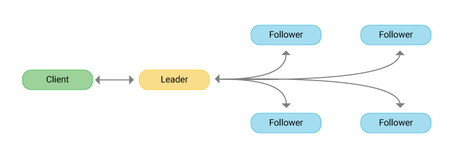

# mini-etcd — **tiny**, persistent Raft KV-store

<p align="center">
  <em>High-level clustor architecture</em><br>
  
</p>

A compact Go implementation of a **Raft** cluster that replicates a Bolt-backed key/value database.  
It is purposely lightweight so you can read the whole thing in an afternoon—yet large enough to expose the real challenges around leader election, log replication, persistence and log compaction.

---

## Project overview

- **Raft core** — leader election, heart-beats, log replication, safety.
- **Storage layer**

  - write-ahead log in **BoltDB**
  - KV bucket with a small in-memory **LRU** hot-set

- **Tiny transport** — JSON-over-HTTP RPC (no gRPC, no protobuf).
- **Binaries**
  - `server` – start a Raft node
  - `client` – PUT / GET helper
- **Tests** — unit, integration & fault-injection (see _tests/_).

> Want the quickest Raft refresher?  
> <https://thesecretlivesofdata.com/raft/>

---

## Building the project

### Prerequisites

- Go 1.22 or newer

```bash
git clone https://github.com/your-org/mini_etcd.git
cd mini_etcd
go mod download
```

---

## Running the simulation

### Single node

```bash
# terminal 1
go run ./cmd/server/main.go -id node1 -addr :9001
```

```bash
# terminal 2
bin/client put foo bar
bin/client get foo        # → bar
```

### Three-node cluster

```bash
# term 1
go run ./cmd/server/main.go -id node1 -addr :9001 -peers node2=:9002,node3=:9003
# term 2
go run ./cmd/server/main.go -id node2 -addr :9002 -peers node1=:9001,node3=:9003
# term 3
go run ./cmd/server/main.go -id node3 -addr :9003 -peers node1=:9001,node2=:9002
```

Wait ~½ s → one prints **“became leader”**.  
Send PUT/GET to the leader; followers forward if you mis-address them.

---

## Running tests

All public tests live in **tests/**.

```bash
go test ./tests -v                # run everything
go test ./tests -run AutoPrune    # single case
```

Some hidden suites are graded for competitions.  
_Hint:_ see the `*_hint.md` files for observable symptoms & points.

---

## Project structure

```
.
├── cmd/
│   ├── client/          # CLI helper
│   └── server/          # wires Raft + KV + HTTP
├── internal/
│   ├── kv/              # Bolt + LRU store
│   ├── raft/            # Raft algorithm
│   └── transport/       # JSON/HTTP RPC
├── tests/               # public tests
└── config/              # timing & pruning constants
```

---

## Test scoring (100 pts total)

| Public test file         | Points | What it stresses                                                         |
| ------------------------ | :----: | ------------------------------------------------------------------------ |
| `cluster_test.go`        | **30** | log replication, consistency under load (`EndToEnd`, `ConcurrentWrites`) |
| `election_test.go`       | **40** | leader fail-over, follower catch-up, single-node persistence             |
| `kv_store_test.go`       | **20** | Bolt + LRU correctness, cache eviction, concurrency safety               |
| `log_truncation_test.go` | **30** | manual / automatic log truncation & firstIndex durability                |
| **Total**                |  120   |                                                                          |

Only the last two suites are active for this repository; the others are
kept at **0 pts**.

---

## Known issues / areas to explore

The codebase ships with several defects and performance quirks that the tests will surface—leader election edge cases, replication gaps, compaction corner-cases, etc.  
Your job is to track them down and fix them.
**Check the hint files** first; they describe only what you can _observe_, not how to fix it.

---

## Configuration knobs

All timings live in `config/constants.go`:

```go
const (
    ElectionTimeoutMin = 150 * time.Millisecond
    ElectionTimeoutMax = 300 * time.Millisecond
    HeartbeatInterval  = 30  * time.Millisecond

    PruneEvery = 2000  // entries
    RetainTail = 100   // keep last N after prune
)
```

---

Enjoy building, breaking & fixing Raft!
